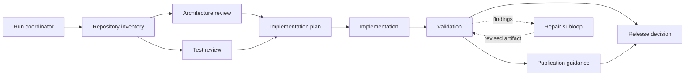

# Forge

Forge is a live LLM-powered engineering workflow coordinator written in Forma.
It combines a validated connected process graph, model-directed tool use,
structured responses, SQLite or PostgreSQL history and recall, context
compaction, bounded parallel graph execution, iterative verification and
repair, capability boundaries, and restart-safe resumable pauses. There is no
scripted agent or fake provider path.

Forge remains in the Forma repository for the 0.2 series so language friction
becomes an explicit compiler or standard-library backlog. Every required Rust
change is recorded in the
[Forge Rust gap ledger](../../planning/design/FORGE_RUST_GAP_LEDGER.md).

## Configure

The checked-in [`forge.settings.toml`](forge.settings.toml) controls:

- provider URL, API-key environment variable, model, reasoning effort, output
  limit, request timeout, and provider response storage;
- bounded workspace collection;
- local SQLite path or remote PostgreSQL URL environment variable, plus recall
  depth;
- provider-side and durable local compaction thresholds;
- total token, wall-clock, workflow, repair, and parallel-worker budgets;
- direct-process allowlists, timeouts, and captured-output limits;
- the plugin folder and Forma executable used for custom tools;
- system and compaction prompts;
- per-role model, instructions, and tool grants.

Only environment-variable **names** are stored. API keys and optional
PostgreSQL URLs are read at runtime and are never written to history.

Validate configuration without contacting a provider:

```sh
./target/debug/forma run \
  --allow-read --allow-env \
  examples/forge/src/main.forma \
  check examples/forge/forge.settings.toml
```

## Run live

```sh
export OPENAI_API_KEY="..."

./target/debug/forma run \
  --allow-read --allow-write --allow-network --allow-env --allow-exec \
  examples/forge/src/main.forma \
  run examples/forge/forge.settings.toml \
  "Review this repository, implement the agreed change, test it, and make a release recommendation."
```

Capabilities are intentionally explicit:

- `read`: settings, graph, and repository evidence;
- `write`: SQLite history and configured file-writing tools;
- `network`: hosted model requests;
- `env`: program arguments and API-key lookup;
- `exec`: commands requested by roles whose settings grant `run_command`.

Forge itself needs `exec` to start isolated Forma tool plugins. Remove
`run_command` from role settings to prevent agents from launching arbitrary
allowlisted engineering commands. Publication is advisory; Forge does not
publish, push, or contact people.

Commands are executed directly—never through a shell—with a configured exact
program allowlist, structured JSON arguments, an empty inherited environment,
a deadline, bounded stdout/stderr, and a canonical workspace directory.
Workspace paths are canonicalized before access, including symlink targets.

Resume a preserved run after intervention or process restart:

```sh
./target/debug/forma run \
  --allow-read --allow-write --allow-network --allow-env --allow-exec \
  examples/forge/src/main.forma \
  resume examples/forge/forge.settings.toml <run-id>
```

Run IDs are UUIDs, not numeric sequence numbers. Forge prints
`Run created: <uuid>` immediately after the initial state is durably stored;
retain that value for `resume`. If no run has yet been created, start one with
the `run` command and a quoted goal before attempting `resume`.

Resume refuses a run when its complete safety-relevant settings or exact
workflow-graph contents have changed. Completed, failed, and cancelled runs
cannot be resumed.

## Process graph



The workflow definition remains an immutable DAG. Independent ready nodes run
in batches bounded by `max_parallel_nodes`; every started result is joined into
the coordinator state before a pause is returned. Iteration lives in a bounded,
revisioned repair session. Findings request repair; progress renews a strategy
budget; repeated findings change strategy; exhaustion preserves the latest
artifact and evidence in `awaiting_intervention` instead of destroying work.

## Contracts and invariants

Forge is also the comprehensive design-by-contract example for Forma. Struct
invariants define durable state validity; function contracts describe
transitions and trust boundaries:

- `NodeRuntime`, `AuditEvent`, `RepairPolicy`, `VerificationResult`,
  `RepairSession`, `WorkflowState`, and `Transition` carry type-wide invariants;
- constructors guarantee normalized initial state and are checked automatically;
- graph operations preserve node cardinality, reachability, and non-negative
  indegrees;
- audit transitions preserve contiguous sequence numbers and monotonic logical
  time;
- `old(...)` specifies affine state evolution across owned transitions;
- quantified postconditions constrain every returned node, degree, or path;
- repair transitions specify revision, strategy, and event-count changes;
- workspace collection proves its configured file and character bounds;
- memory and provider boundaries reject negative budgets and token counts;
- untrusted JSON/TOML decoders remain total and return errors rather than using
  preconditions to assume valid external data.

Contracts and invariants are enabled during normal execution. The offline test
suite exercises valid state transitions and separately proves that an invalid
`AuditEvent` fails at its construction boundary with the declared invariant
message. `forma verify --level formal` honestly reports these string- and
struct-heavy obligations as `UNKNOWN` until the SMT subset grows; Forge does not
relabel runtime enforcement as formal proof.

## Agent and tool loop

Each model response conforms to a strict JSON schema generated from the plugins
granted to that role. It either:

- requests one configured tool (`read_file`, `list_directory`, `write_file`, or
  `run_command`); or
- returns a completed artifact, findings, a blocked state, or an error.

Tool requests are checked against the discovered plugin catalog, role settings,
and runtime capabilities.
Relative file paths are confined to the canonical `workspace_root`; absolute
paths, `..`, and symlink escapes are rejected. Every prompt, response, and tool
result must enter durable history before the next provider call. A storage
failure pauses the run instead of continuing without an audit trail.

## Custom tool plugins

Forge tools are real folder-based plugins, not names wired to implementations
inside the orchestrator:

```text
tools/
  my_tool/
    tool.toml
    tool.forma
```

`tool.toml` declares the model-visible contract and the minimum capabilities
for its Forma implementation:

```toml
version = 1
name = "my_tool"
entrypoint = "tool.forma"
capabilities = ["network"]
environment = ["MY_SERVICE_TOKEN"]
description = "Query the configured engineering service."
input_description = "A project-relative query."
payload_description = "A JSON object containing optional filters."
```

`tool.forma` is an ordinary Forma program. Its `args()` array contains exactly
three strings: `tool_input`, `tool_payload`, and a JSON context object. The
context currently contains `workspace_root`, the direct-command allowlist,
`command_timeout_ms`, and `max_command_output_chars`. The program writes its
result to stdout; a nonzero exit or empty output becomes a tool error.

To add a custom tool:

1. Add its folder, manifest, and Forma source under the configured
   `tools.plugins_path`.
2. Declare only `read`, `write`, `network`, and/or `exec` capabilities that its
   source actually needs.
3. List only required secret-variable names in `environment`. Forge clears the
   child environment and copies those values explicitly; names, never values,
   belong in the manifest.
4. Grant the plugin name to selected roles in `forge.settings.toml`.
5. Run `check`; unknown grants, duplicate names, unsafe manifests, missing
   sources, and unsupported capabilities are rejected before an LLM call.

The plugin folder is loaded in deterministic order; its complete manifest
contract and SHA-256 source digest participate in the resumability digest.
Changing a plugin therefore prevents an old run from resuming under silently
different behavior or authority. Plugins
are trusted application code, and Forma capability checks are containment—not
a complete hostile-code sandbox. Use OS isolation for untrusted plugins.

## Memory and compaction

The history database (SQLite locally, PostgreSQL remotely) contains:

- runs and terminal/resumable status;
- ordered messages for inputs, structured responses, and tool results;
- response IDs and token usage;
- durable compaction summaries with message watermarks.
- the append-only workflow event journal used for replay and resume.

Recall combines the latest durable summary with recent messages. When
uncompacted history crosses `local_trigger_chars`, a dedicated compactor role
creates a new summary. Requests also enable provider compaction with a
`context_management` array containing a `compaction` entry and its
`compact_threshold`. Local summaries remain the durable source of truth; Forge
does not require provider-side conversation storage.
Token accounting includes both agent messages and compaction calls. The
configured token and workflow deadlines are cooperative hard stops between
bounded effects; an already in-flight provider response can finish before the
pause is recorded.

## Testing

Normal CI never pretends to be an LLM. It checks:

- settings and graph validation through the packaged Forma executable;
- structured request construction and raw Responses API parsing;
- per-role tool authorization;
- manifest discovery and an end-to-end custom Forma plugin invocation;
- SQLite schema, history, token accounting, event replay, recall, watermarking,
  and compaction persistence;
- real deferred/concurrent `sp` execution rather than synchronous evaluation;
- positive and negative contract enforcement at the packaged CLI boundary;
- the pure graph and repair kernel through the regular Forma corpus and tests;
- registry, capability, and interpreter coverage for authenticated HTTP.

Run the Forge checks:

```sh
cargo test --test forge_example
```

A real provider run is credentialed, networked, nondeterministic, and
potentially billable, so it is deliberately opt-in rather than a CI fake.
PostgreSQL is also tested through an opt-in live round trip:

```sh
FORMA_TEST_POSTGRES_URL="postgresql://..." \
  cargo test --test forge_postgres -- --nocapture
```

Use a dedicated test database; the check creates the normal Forge schema and a
diagnostic run.

## Layout

| Path | Responsibility |
| --- | --- |
| `forge.settings.toml` | Provider, memory, compaction, limits, prompts, roles, tools |
| `fixtures/project-review.json` | Connected process graph |
| `src/model.forma` | Graph, runtime, settings, and model-result types |
| `src/settings.forma` | Settings decoding, validation, and role policy |
| `src/provider.forma` | Authenticated structured Responses API adapter |
| `src/memory.forma` | SQLite/PostgreSQL history, event replay, token accounting, recall, compaction |
| `src/workspace.forma` | Bounded repository context collection |
| `src/agentic.forma` | Live tool loop, graph execution, and repair |
| `src/tool_plugins.forma` | Plugin manifest/source loading, validation, catalog, and digest |
| `src/graph.forma` | Connected-DAG validation and queries |
| `src/kernel.forma` | Pure affine scheduling and repair transitions |
| `src/main.forma` | `check`, `run`, and `resume` commands |
| `src/infrastructure_check.forma` | Offline infrastructure assertions, no fake agent |
| `src/tool_plugin_check.forma` | End-to-end custom plugin discovery and execution |
| `src/contract_check.forma` | Positive fixture covering contracted pure transitions |
| `src/contract_violation.forma` | Negative fixture proving runtime contract enforcement |
| `tools/*/tool.toml` | Model contract, capabilities, and secret-name allowlist for one plugin |
| `tools/*/tool.forma` | Custom Forma implementation for one plugin |

The design rationale is in
[`FORGE_HARNESS_DESIGN.md`](../../planning/design/FORGE_HARNESS_DESIGN.md).
