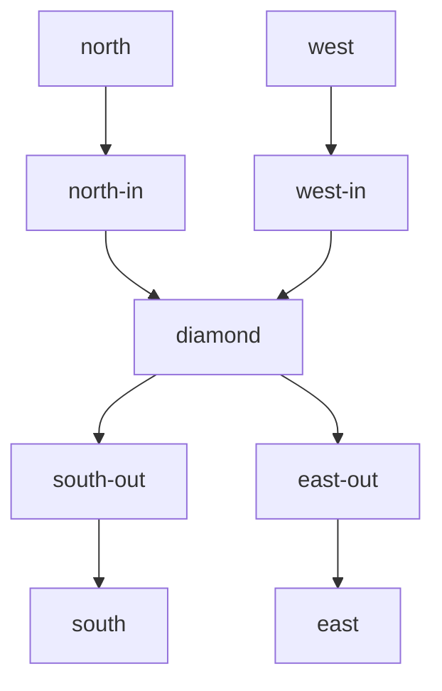

# Switchyard

Switchyard is a deterministic railway-interlocking simulator and bounded model
checker written entirely in Forma. It needs no API key and no external service.
Its purpose is to make Forma's safety, ownership, contracts, effects, durable
state, structured concurrency, and formal-verification direction visible in one
small application.

The included diamond crossing has two mutually conflicting routes:



`north-south` and `west-east` may never hold active reservations together.
Commands that would violate that rule are rejected as ordinary transition data
and appended to the audit history. They do not crash the simulation.

## Run it

Build Forma from the repository root:

```bash
cargo build
```

Then use the example CLI:

```bash
# Validate TOML settings, JSON topology, connected routes, and conflicts.
./target/debug/forma run --allow-read --allow-env \
  examples/switchyard/src/main.forma check \
  examples/switchyard/switchyard.settings.toml

# Explore every distinct reachable operational state through depth 8.
./target/debug/forma run --allow-read --allow-env \
  examples/switchyard/src/main.forma verify \
  examples/switchyard/switchyard.settings.toml

# Run the narrated crossing and prove a SQLite persist/load/replay round trip.
./target/debug/forma run --allow-read --allow-write --allow-env \
  examples/switchyard/src/main.forma simulate \
  examples/switchyard/switchyard.settings.toml

# Run the complete deterministic acceptance check used by CI.
./target/debug/forma run --allow-write \
  examples/switchyard/src/offline_check.forma
```

The default bounded check explores 45 distinct operational states, checks every
candidate successor for safety, and separately injects a collision to prove the
checker can produce a failing property rather than merely returning green.

Network access is optional. Set `network.status_url` to an unauthenticated HTTP
endpoint and run:

```bash
./target/debug/forma run --allow-read --allow-network --allow-env \
  examples/switchyard/src/main.forma publish \
  examples/switchyard/switchyard.settings.toml
```

The deterministic simulation and verification paths never require network.

## What the example exercises

| Forma pillar | Switchyard use |
| --- | --- |
| Affine ownership | The transition kernel consumes one complete state and returns its successor. Search branches call an explicit `copy_state` boundary. |
| Borrowing | Graph queries, safety predicates, persistence, and reporting use shared `ref` parameters. |
| Contracts | Constructors and transition helpers declare preconditions and postconditions, including monotonic sequence and route progress. |
| Struct invariants | Trains, events, states, transitions, settings, topology, and exploration results reject invalid local values at runtime boundaries. |
| Algebraic error handling | JSON/TOML, files, HTTP, channels, and databases use `Result`/`Option` pattern matching. |
| Graphs | JSON routes are checked as connected segment paths with explicit symmetric conflict edges. |
| Pure/effectful separation | `kernel.forma` and `explorer.forma` are deterministic; `journal.forma` and `main.forma` own hosted effects. |
| Capabilities | Read, write, environment, and optional network authority are independently granted at the CLI. |
| Durable resources | SQLite is an affine `Database`; prepared statements persist the append-only event journal. |
| Replay | Loaded events re-execute the pure kernel and must reproduce both the operational state and exact event log. |
| Structured concurrency | A spawned pure task computes the command-space bound and is awaited; a typed channel carries verification status. |
| Interchange | Human settings are TOML; topology and optional HTTP status payloads are JSON. |
| Bounded verification | Every accepted successor is explored to a configured depth; unsafe successors return a replayable command trace. |

No Rust is used in Switchyard itself or in its acceptance test. The CI job
executes the Forma programs directly.

## Safety properties

`check_safety` evaluates five properties after every explored transition:

1. **Collision freedom** — no two trains occupy the same non-empty segment.
2. **Reservation before entry** — an occupying train has active movement
   authority.
3. **Route exclusion** — active reservations are pairwise non-conflicting.
4. **Train conservation** — train identities remain unique.
5. **Event monotonicity** — event indices are contiguous and agree with the next
   sequence number.

Topology validation adds connected movement: every route must be a non-empty,
duplicate-free chain whose first source is the declared entry and whose final
target is the declared exit.

The `collision_probe` is intentionally invalid only at the global-property
level. Each `Train` and `Reservation` still satisfies its local struct
invariants. This distinction demonstrates why type invariants and relational
system properties are complementary.

## Verification ladder

Switchyard intentionally separates claims by confidence:

1. Runtime struct invariants guard construction and ownership boundaries.
2. Function contracts guard individual calls and transitions.
3. `offline_check.forma` executes positive paths, safe rejection, TOML/JSON,
   SQLite, exact replay, and the negative collision probe.
4. `explorer.forma` exhausts the finite state graph up to `bounded_depth`, with
   operational-state deduplication and counterexample traces.
5. `solver_targets.forma` isolates scalar and structural proof obligations,
   including invariant establishment and preservation, for
   `forma verify --level formal`.

Run the present solver boundary with:

```bash
./target/debug/forma verify \
  examples/switchyard/src/solver_targets.forma \
  --report --level formal --solver z3 --require-proved \
  --emit-smt target/switchyard-smt
```

All seven targets become `PROVED` when an SMT solver such as Z3 is installed.
They cover scalar control flow, tuple equality, named-struct construction,
projected mutation, and invariant establishment/preservation. The verifier
follows short-circuit branches path-by-path, checks signed 64-bit arithmetic
safety, and rejects proofs with unsatisfiable preconditions or invariant
assumptions as vacuous. Vector/index reasoning, graph reachability, loops,
recursive/indirect calls, and references remain explicit `UNKNOWN` frontiers in
Forma 0.2. Direct pure source calls are symbolically inlined. Unsupported
obligations are never reported as proofs.

The intended solver growth path is:

1. add reusable pure-function summaries and clause-level proof results;
2. encode fixed-size route/reservation arrays and enum-like statuses;
3. prove each transition preserves collision freedom and route exclusion;
4. generate counterexamples as Switchyard `Command` traces;
5. add quantified train/route domains and inductive invariant preservation;
6. add bounded liveness: a granted, repeatedly advanced route eventually
   releases.

That progression gives formal-verification work a concrete application and
stable regression corpus instead of isolated theorem snippets.

## Source map

| File | Responsibility |
| --- | --- |
| `src/model.forma` | Domain types, local invariants, contracted constructors |
| `src/graph.forma` | JSON decoder, connected-path and conflict validation |
| `src/kernel.forma` | Pure commands, transitions, and safety predicates |
| `src/explorer.forma` | State copying, deduplication, bounded search, collision probe |
| `src/scenarios.forma` | Deterministic crossing fixture |
| `src/settings.forma` | TOML decoding and bounds |
| `src/journal.forma` | SQLite persistence and exact deterministic replay |
| `src/main.forma` | Capability-gated CLI, task/channel use, optional HTTP |
| `src/offline_check.forma` | Eleven-check no-network acceptance suite |
| `src/solver_targets.forma` | Minimal present and future SMT obligations |

One current concurrency limitation is deliberately visible in the design:
task-capture analysis is conservative for live affine aggregate parameters.
Switchyard therefore spawns a scalar proof-support computation, while the
aggregate state explorer remains deterministic in the parent task. Supporting
owned `Send` transfer of user-defined aggregates would let complete search
shards move safely into workers without changing the pure kernel.
